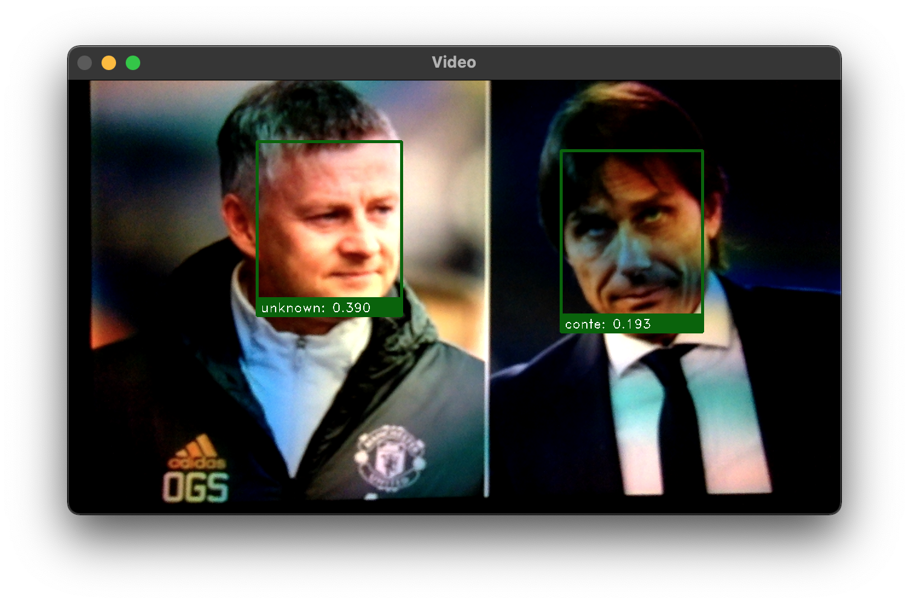

# Face Recognition
**Simple implementation for Face Recognition using ONNX Runtime.**\
Face detection  : Ultra-light face detector (ONNX)\
Face alignment  : Shape predictor 5 face landmark (dlib)\
Face recognition: Mobilefacenet (ONNX, convert from PyTorch)\
We also deploy an api to generate face embbeding on Heroku.

## Requirements
```python
pip install -r requirements.txt
```

## Get Face Embedding
Place image in ./data/raw/{person name}/
```python
python train.py
```
Face image stored in ./data/face/{person name}/ \
Face embedding stored in ./data/dummy_db.json

## Test Using Webcam
```python
python test.py
```
